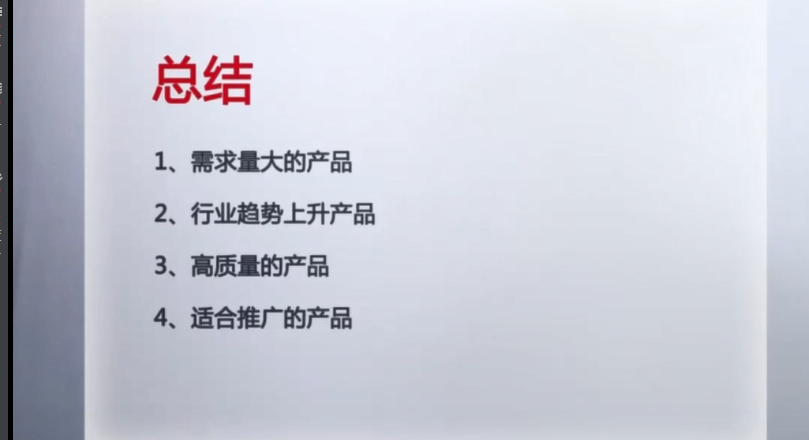

#### 亚马逊编码

- ASIN: 亚马逊标准标识号,每个商品一个，带连接，可以搜索，促销、广告、跟卖可能需要用到
- 变体:不同颜色不同尺码，真正的产品是变体的子体
- UPC码：商品标识码，必填项，如何获得名中国物品中心够买价格一块钱左右，淘宝也可以进行购买，有证书颁发的比较可靠
- SKU:一款产品一个SKU识别商品，
  - 对于电商而言，SKU是指一款商品，每款产品都会出现一个SKU，便于识别商品。
  - 编写SKU技巧：
    - 根据变量（Variation）种数设置SKU的变量标示
    - 遵循原则：统一格式、统一含义，简明扼要
  - 一款商品如果有多种颜色，该款产品就有多个SKU，例如：一件衣服有红，白，蓝则不同颜色的同件衣服，SKU编码也不相同，如相同则会出现混淆，发错货。
  - 例如：站点编号+站点英文简称+产品码编号+品名+颜色+尺寸
- GCID：亚马逊内部生成的品白标识符，可以取代UPC，防止跟卖进行品牌备案

#### 产品五要素（静态评分加动态评分=质量评分）

- 标题:体现产品的重要信息

#### Listing标题写法

- 品牌 + 产品型号/系列 + 材料/关键词 + 颜色 +尺寸 + 包装/数量

- 标题雷区（可容纳200字符太多就导致过于臃肿，80个比较适宜，标题设置的时候需要考虑移动端，需要更改需要客服的协助）

#### 标题雷区提醒

- 勿放虚假的产品标题提升搜索，客户就算搜到了，转化也不见得会高
- 标题勿放别人得品牌名，有侵权得危险。建议申请自己得品牌商标
- 勿赛过多的字，过于杂乱的标题会让买家不信任，重在给消费者传达正确的信息
- 除and，or，the，with，for，a，an之类的介词外，每个单词首字母大写
- 合乎语法，80个字符最佳。不要出现拼写错误的低级错误
- Listing一旦上传，所有权便不再是卖家。如果listing上架后表现稳定，无法修改编辑，请开case联系亚马逊修改

- 图片:最好自子拍图，切勿侵权

#### 主图要求

- 主图背景必须是纯白色（亚马逊搜索及产品详情页节面的也是纯白的，纯白的RGB值是255，255，255）
- 主图不能是绘画或者是插图，而且不能包含实际不在订单内的配件、道具
- 主图不能带logo和水印（产品本身的logo是允许的）
- 主图中的产品最好是占据图片大约85%左右的空间
- 产品必须在图片重清晰可见，如果有模特，那么模特不能是坐姿，最好站立
- 如果要使用模特就用真人模特，不能使用服装店里的模型模特
- 不能有裸体信息

#### 辅图要求

- 辅图应该对产品做一个不同的展示，产品使用的展示，或者对主图重没有凸显的产品特性做补充
- 亚马逊产品的listing重卖家可以最多添加8张辅图
- 辅图最好也是和主图一样纯白的背景，但不做强制要求，不是纯白问题也不大
- 辅图不能带logo和水印（产品本身的logo是允许的）
- 产品必须在图片重清晰可见，如果有模特，那么模特不能是坐姿，最好站立
- 如果要使用模特就用真人模特，不能使用服装店里的模型模特
- 不能有裸体信息

#### 图片尺寸

- 图片的长度或者宽度任意一边大于1000像素时，该图片就可以有“zoom function”图片放大功能。

（“zoom function”被亚马逊证实过对产品销量提高有一定的帮助）

- 图片最短边如果小于500像素，上传时会被亚马逊系统直接拒绝。
- 图片格式（JPEG,TIFF,GIF）这些格式的图片可以在亚马逊上传的（推荐JPEG格式的图片，这个格式的图片上传时熟读更快）

#### 五行描述

帮助客户快速的阅读和理解产品。可根据产品的特点来发挥

一个优秀的短描述，更能抓住客户的内心，刺激消费者购买行为。

- 简明扼要。在语句通顺的前提下部署少量关键词
- 表达亮点。五行关键点主要包括从，原材料尺寸、功能、特点、优势、包装、用途、保修。

将消费者想要知道的点都写出来。

- 排版整齐，要有美感。短句排在前面，长句排在后面，同事思考客户最疑虑的重要部分，重点解释，描述清楚。
- 使用特殊标点符号

#### 文案换行语法和html 语法保持一致

- 详情描述：2000个对5行描述进行深入的描述，产品的特性，使用说明，售后，包装等
- 关键词
- 单词进行匹配标点符号会影响抓取关键词不叠加（工具merchantwords）

#### 如何获取关键字

- 亚马逊搜索下拉框（站内热搜词可作为关键字参考。）
- 看竞争对手的标题和描述用什么关键词（搜索best seller，可以借用其标题的中电搜索词）
- 看客户在用什么关键词（review，Q&A）
- 利用相关工具，helium10
- PPC关键词

#### 产品如何上传

库存->新商品->创建新商品

可以通过搜索查看商品分类

工厂名称 填写 商标名称或者品牌名称

product Id UPC码

Brand 品牌

variztions 变体

#### FBA实操

- 合仓设置：设置->亚马逊物流->入库设置->编辑->库存配置服务

- 危险品审核:易燃易爆毒品危险品

- FBA转化:库存->选择商品（变体需要展开）->库存限制5000->预处理方（卖方）->=打印标签->检查货件（标签和产品配对）->配送服务->货件包装->打印货件标签（默认美国性质）->填写物流信息->准备产品打包联系货代公司

  - 打印标签FBA 一个商品一个

  - （属于审核品需要体检审核）混装发货一个箱子多个SKU

- 打印标签：提前打印标签发给工厂
- 配送服务：亚马逊可以提供其他平台配送->创建多渠道订单

#### 跟卖（跟卖产品最好不要选择FBA）考虑自己跟卖自己的产品可以

- 前台登入：[Sell on Amazon](https://sellercentral.amazon.com/abis/syh/DisplayCondition/ref=dp_sdp_sell?_encoding=UTF8&mons_sel_best_mkid=amzn1.mp.o.ATVPDKIKX0DER&ld=AMZDP&coliid=&asin=B001GAOTSW&colid=&qid=1610625142&sr=8-1-spons)进行跟卖

- 后台：库存->添加新商品->通过ASIN码进行 跟卖->进行产品状态
- 自己跟卖自己的产品:获取一些不是FBA发货方式的资源
- 如何防止被跟卖:
  - 产品的硬实力
  - 申请站点的商标专利
  - 提高listing的质量，运营实力
  - LOGO在产品包装 或者 产品上体现出来
  - 出售特色产品，搭配出售
  - 品牌备案

#### 多账号操作

##### 账号的风险

- 账号关联
- 产品授权
- 账号绩效
- 违规操作

##### 账号的作用

- 分担账号风险
- 缩短回款周期
- 规避操作风险
- 升级账号权重（老帐号养子账号）

##### 账号类别

- 主账号 —— 卖货
- 次账号 —— 卖货
- 辅助账号 —— 配合（上评价，尽量与主账号产品互斥）

#### FBA定价利润和产品补货周期

- Listing 销量 = 流量 * 转化率

- Listing 销售额 = 流量 * 转化率 * 客单价

*飞轮理论*

流量降低转化率不变-> 价格->评分 ->生命周期

流量不变转化率降低

客单价和利润率 决定理论额

价格决定客户群体

产品成本 头程，定价，PPC（10%），库存费用，佣金，售后，退货率（3%）

转化率不变（）

节假日提前布局布局时间加上头程时间

- 爆款产品的需要条件
  - 产品授权
  - 产品差异化
  - 产品高利润（利润高操作空间大）
- 爆款类型
  - 平稳型
  - 热点型
  - 粗暴型 

- 补货周期
  - 小批量多次（空运）
  - 大量海运

#### 产品的生命周期

- 介入
- 成长
- 成熟（说明生命周期快到头了）
- 衰退

通过评价来定位产品的生命周期

#### 站内竞品

市场调研表格

关联产品网站 www.yasiv.com 周边选品

通过谷歌趋势来确定站外流量

站外 INSIDER

#### Listing上架的准备工作

图片（专业人拍视：外包）

文案（关键词，搜索词，卖点词，营销词提炼）属性词功能词，适合什么场景，适合什么人源

供应商（确定采购周期）

货代(厂家到货代的时间)

容错量 30 天 15 天 3天的 容错量相加除以3每各天更新

发货200 - 500 个

新品带老库存捆绑

- 上架节点：上架名称是否对的上
- 共享节点的话：产品没有优势选择小类目

推广周期计划 -最多一个月

上架将库存转为0 或者直接发FBA

上架后最好不要修改

优化listing 小改最好不该

#### listing规则

- 图片：7张，主图白底（纯白255，255，255）主图不要logo 和水印
- 图品压缩策略（优化买家打开速度），图片占比 百分80 ，使用参照物
- 标题 可搜索性，可读性
- 品牌+描述+分类+特性（营销词不能夸张实事求是）

标点符号分隔后单词不进行组合

详情描述和5店描述可以重复

5行关键词最好不要和标题重复，亚马逊有去重策略

一行50个字符从前到后权重逐渐降低，和标题会去重

5点描述 详情描述

问答尽量用关键词回答，关键词会被检索到

对产品有信心找亚马逊做评价 60 美金 5个评价

积累粉丝群体

站外测评师（刷单）

服务商（刷单）自发货刷一个抓一个

了解 合并变体

刷一些差评来误导买家

用买家举报差评，然后开case给亚马逊删差评，尽量不要找服务商，贵并高风险

#### 遇到差评如何解决

- 联系买家：希望不大
- 好评覆盖：

#### 新品如何快速生长

- 站内流量:关键词排名(搜索，自然排名，广告排名)
- 类目检索:会将产品表现较高的产品展现
- 产品关联:买家同事一起够买的产品，周边产品可以用来选品打包销售
- 榜单:5大榜单
- 活动入口

埋词尽量符合买家习惯

新品推广时间节点 两到三周

#### 推广节点

- PPC ————关键词排名

- 促销则扣上榜单

- 增加关联流量

- 稳定排名与销量
- 留评率不要超过10%

#### 亚马逊广告种类

- PPC (Pay Per Click) 点击付费
  - 点击流量高在第三名靠后
  - 广告开在前三页————新品开在第三页比较合适
  - 推广成本 第一页80% 第二页13% 第三页5%
- CPM (Cost Per Mile 按展示收费) - 品牌影响力
- CPA (Cost Per Action)亚马逊联盟类似淘宝客

#### 广告排序规则与算法

- 任何排名都基于关键词
- AD ranking = BID（PPC价格） * 产品表现（质量分）
- 实际出家 = RANK下一级的分值/产品表现（质量分） + 0.01
- 质量 = 点击率 + 转化率

#### PPC基本结构组合

#### Match type

shoes Match false

多了属性词不匹配

关键词不区分大小写

一个广告活动不建议开多个产品

变体可以放在一个广告活动 ————前期每个变体都开广告组测试那个广告组，选出比较好的sku

建议一个产品三个广告活动一个一种匹配方式再加一个自动广告

精准匹配 10times+才比较有效果

转化率比较低广泛，较高精准匹配

点击率影响质量分，一周（7天）曝光大于1000 点击率高于百分0.7 精准 点击率低于0.7 广泛

点击率较多没有出单 直接pass

#### 选品

#### 产品市场分析的重要性

- 即使把握消费者需求
- 防止决策事务
- 有利于发现新的市场机会（例如盆栽就不适合美国，因为本土原因美国房子面积大，考虑本都原因）

#### 亚马逊选品思路

- 本地化

- 合适的体量

- 以盈利为目标

- 严谨(凭数据为依据)

  主观判断，往往容易出错

- 抓住客户的痛点，需求（通过客户的评论，找到产品的缺陷）

#### 创新型产品

- 需求点
- 消费人群
- 性价比

#### 如何找到好产品

- 好产品的定义
  - 没有最好的产品，只有最适合自己的产品。
  - 不同产品的市场容量，利润等，是不一样的，对于买家的要求，也是不一样
- 如何找到合适自己的产品
  - 是否有自己的工厂
  - 有没有专业团队的配置
    - 专业站外团队（刷单团队）
    - 运营团队
    - 供应链团队
    - 美工团队
    - 物流团队
  - 可用的资金量
  - 自己熟悉的产品或者品类  
- 账号定位
  - 季节性产品——节日用品、服装（提前2-3个月布局）运营团队，供应链团队
  - 全年普通款————团队要求较低
  - 全年普通款+爆款产品
    - 爆款：高体量，高竞争，搞利润
  - 全年爆款：资金量足够大，抢大运营团队，站外团队

#### 选品流程和方法

- 选品流程:粗选->产品分许->数据实测->侵权查询->功能实测->产品开发
- 粗选:
  - bast saller选品法
  - 产品扩展法：基于产品的原料或者技术基于目标群体
  - 众筹选品法：适用查找新品的买家
  - 热点捕捉法：商业嗅觉需要灵敏
  - 展会选品法：展会有哪些，香港美国
  - 优秀店铺复制法
  - 根本行业大卖家
- 产品利润核算：产品售价 - FBA分拣包装费 - 头程运费 - 产品成本 - 推广费用（售价的百分10）
- 数据实测:
- 侵权查询：必要的一步，尤其大机器产品
- 功能实测：改良后必须进行实测

#### 选品思维及误区

- 产品开发
  - 从评价找突破
  - 套装: 羽毛球绑定两个羽毛球售价加高，打包零售，思考客户心里打包一起销售
  - 服务差异化：美国比较注重包装
- 容易进入的误区
  - 选品贪多贪全（让客户进入选择困难症，挤压库存）
  - 盲目追求独家、差异化（生面周期较短）
  - 选品数量过少（一次上4-5款）
- 模式和策略
  - 铺货模式（不压货，放多产品自发货。1688拿货）季节性产品通过多个产品提高成功率
  - 精品模式（较强的选品人员）
  - 工厂模式（ 弊端生命周期长，提高）

#### 如何做市场调研

- 市场容量：
  - 平台产品销量
  - 平台产品数
- 搜索增长
  - 近五年搜索增长
  - 近一年搜索增长
- 搜索量
  - 近一年月关键词搜索量

#### 市场调研分析表

体量（搜索量，产品量，竞争度）->搜索增长（5年趋势，1年趋势）->总结

平台需求,竞争，市场需求趋势，是否有旺季，旺季的区间

#### 粗选分析表

序号，产品，类目，关键词，在线listing，搜索量，竞争度，谷歌趋势，利润空间

根据产品是否有专属的板单，有的话top100否则主关键词100

通过评价来推算明年的销量

top100产品分析表

缺点，总结

加个分析表

### 搜索引擎SEO

#### 谷歌SEO和亚马逊SEO的区别

- 谷歌SEO——信息检索传播
  - 长尾关键词
  - 优质原创内容
  - 点击率、跳失率
  - 外链影响大
- 亚马逊SEO——产品搜索交易
  - 短尾关键词优化
  - 优质的Listing
  - 点击率、转化率
  - 外链影响小

#### 亚马逊A9算法

- 转化率
- 客户留存率（跳失率，留存时间）
- 相关性

#### 亚马逊站内流量入口

- 关键词搜索
  - 搜索相关性